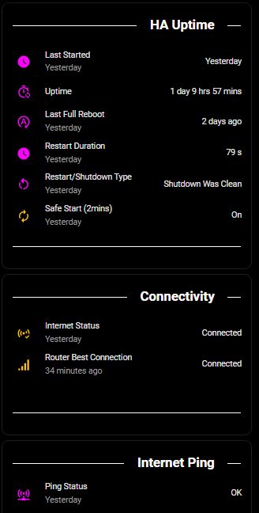
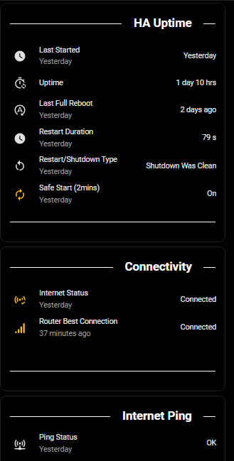
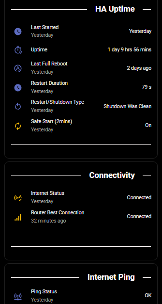
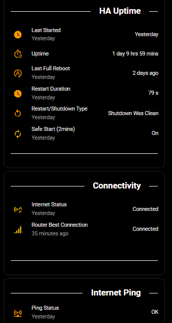
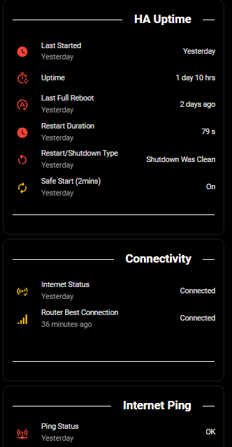
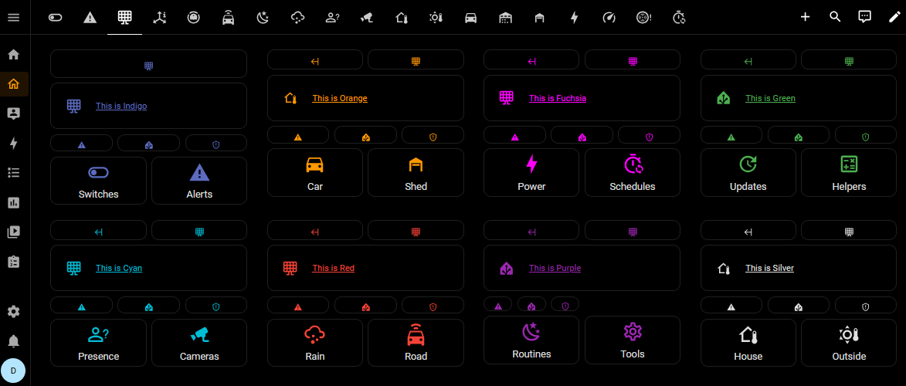

# Very Dark Black Theme for Home Assistant

[](https://hacs.xyz/) [](https://hacs.xyz/docs/faq/custom_repositories) [](https://github.com/PlayFaster/very-dark-black-ha-theme/releases) [](https://opensource.org/licenses/MIT) [](https://github.com/PlayFaster/very-dark-black-ha-theme/actions/workflows/validate.yaml) [](https://github.com/PlayFaster/very-dark-black-ha-theme/commits/main)

A Home Assistant dark mode theme that provides black or very dark backgrounds wherever possible along with a choice of primary colors.

> [!NOTE]
>
> **Is this the right theme for you?**
>
> - If you want a very dark black theme, with black backgrounds everywhere and a choice of accent colors, then **yes**.
> - **This theme is for you if** you want:
>   - **Black Backgrounds Everywhere** — Pure black background applied everywhere possible.
>   - **A Clean Plain Look** — Black, white and an accent color are what you get on most views.
>   - **Accent Colors** — A choice of bold accent colors, so it's not just monochrome.

## ✅ Features

This is a simple theme focused on providing a very dark mode look. It's designed to be clean and simple, with a choice of primary colors.

- **Black Backgrounds**: Black background applied everywhere.
- **Primary Color Choice**: Various sub-themes with different foreground colors.
  - 🔵 Cyan
  - 🟢 Green
  - 🔴 Red
  - 🩷 Fuchsia
  - 🟠 Orange
  - 🟣 Purple
  - 💙 Indigo
  - 🔘 Silver (Monochrome)
  - Black (Standard): A monochrome theme (this is the base the others are built on).
  - Black (Background Only): This is the "sub-base" theme. It must show in the picker due to Home Assistant's theme structure.

## 📋 Requirements & Compatibility

- **[`card-mod`](https://github.com/thomasloven/lovelace-card-mod)** – Highly recommended. The theme will still work without this integration, but `card-mod` is used to polish fine UI details and ensure a consistent experience across all elements.

To ensure all features (like custom scrollbars and border removals) work correctly, verify you meet these minimum requirements:

| Dependency         | Minimum Version | Reason                                   |
| :----------------- | :-------------- | :--------------------------------------- |
| **Home Assistant** | `2022.11.0`     | Required for `ha-card` border variables. |
| **card-mod**       | `3.0.0`         | Required for theme-level CSS injection.  |

The theme is fully usable from HA 2022.11 onwards. Newer versions have additional refinements:

- **2022.11+** — Core dark backgrounds, cards, sidebar, and text
- **2025.1+** — Inputs, dialogs, and modern card layouts
- **2026.4+** — Dynamic HSL color scales
- **2026.5+** — More Web Awesome tokens for `ha-switch`, `ha-checkbox` and `ha-progress-bar`.

## 📸 Screenshots

### Accent Colors

| Cyan | Fuchsia | Silver |
| :-: | :-: | :-: |
|  |  |  |

| Indigo | Orange | Red |
| :-: | :-: | :-: |
|  |  |  |

### Themed Sections (mixed)



### Theme Selection


## 📥 Installation

### Prerequisites: Enable themes and install card-mod

1. Install `card-mod` via [HACS](https://hacs.xyz/) or per the instructions on its [GitHub page](https://github.com/thomasloven/lovelace-card-mod "card-mod").

2. Add the following to your `configuration.yaml` file if not present (HA restart required):

```yaml
frontend:
  themes: !include_dir_merge_named themes
```

### Download Theme

#### ✨ HACS (Recommended)

1. Add this URL as a **Custom Repository** in HACS. [https://github.com/PlayFaster/very-dark-black-ha-theme](https://github.com/PlayFaster/very-dark-black-ha-theme)
   - Open HACS in Home Assistant
   - Click **Custom repositories** (⋮ menu)
   - Add repository URL and Type: `Theme`
2. Search for "Very Dark Black Theme" and click **Download**
3. Run the `frontend.reload_themes` action (Restart Home Assistant if `configuration.yaml` changes were made).

#### 💾 Manual Installation

1. Under the Home Assistant `config` folder, create a new folder named `themes`.
2. Copy the theme YAML file into it.
3. Run the `frontend.reload_themes` action (Restart Home Assistant if `configuration.yaml` changes were made).

### Apply Theme

- **Change System Theme**: Go to your [Profile General](https://my.home-assistant.io/redirect/profile) tab (bottom left of screen) and change Theme under **_User preferences_**.

> [!TIP]
>
> **Remember that you can apply a theme at the _system level_ OR to individual custom dashboard **views** OR **sections**.
>
> - From any custom dashboard view, click the pencil icon (top right) _then_:
>   - **View**: Use the pencil icon for the specific view (**_second_** row) and you will find a Theme selector down in the options.
>   - **Section**: Use the **three dots** (⋮) at the top right of the specific Section, then **_Edit_** and you will find a Theme selector at the end of the options.

### Automate Theme Changes

You can use a Home Assistant automation to change the system theme at startup, or based on any other time or condition you wish.

- **Important:** In the [Profile General](https://my.home-assistant.io/redirect/profile) screen, you **must** keep **"Use default theme"** selected under _User preferences_ > _Theme settings_.
- If you manually select a specific theme in your profile, the automation will not be able to override it.
- This works by setting the System Theme to **"Use default theme"** and then using an Automation `action:` to change the default theme.

Example automation to set the theme at startup:

```yaml
alias: Set (Default) Theme at Startup
description: |-
  This automation allows you to set or change the default theme at Home Assistant Startup, provided you keep the Default Theme selected.
triggers:
  - trigger: homeassistant
    event: start
conditions: []
actions:
  - action: frontend.set_theme
    data:
      name: Black with Orange
      name_dark: Black with Orange
mode: single
```

## 🗑️ Removal

First, set a different theme:

- Go to your [Profile General](https://my.home-assistant.io/redirect/profile) tab (bottom left of screen) and change Theme under User preferences.

If you installed manually:

- Under the Home Assistant `config/themes` folder, delete the `very_dark_black_ha_theme.yaml` file.

If you installed via HACS:

1. Go to **HACS**.
2. Find **Very Dark Black HA Theme** and click into it.
3. Click the **three dots** (⋮) at the top right and select **Remove**.
4. Restart Home Assistant.

## 🏗️ Under the Hood - Technical Architecture

For technical details on the YAML standards, icon logic, and Shoelace tokens used in this theme, see the [Development Reference](docs/theme_dev_reference.md).

## ❓ FAQ & Troubleshooting

### **Theme fails to apply**

- Ensure that you have followed the [Installation](#-installation) instructions above.
- If you have not used themes before and have had to add `themes: !include_dir_merge_named themes` to your `configuration.yaml` file, you MUST restart Home Assistant.

### **Theme fails to apply in specific dashboard view or cards**

- Items like custom dashboards (dashboard views), cards and card elements can have specific themes applied, separate to the system theme.
- To check or modify this for views or sections, see [Apply Theme](#apply-theme) above.
- If one element has a different (unexpected) theme, it may be a theme or color setting inside the individual card:
  - To check use the pencil icon (top right), then click into the specific card and look for theme and/or color options in the settings.

## ⚠️ Known Limitations /❔ What's Missing?

- **Color Picker**: The theme has eight pre-defined accent colors available, but there is no option to select your own accent color to work with the theme. To my knowledge, this functionality is not available within the Home Assistant basic theme file, it would require an additional script or custom component, so it is not in scope for this project.
- **Light Theme**: The theme works in "Light" mode, but still applies the Very Dark Black theme, a dark mode theme. This is deliberate, this is not a light mode theme.
- **Base Themes in Picker**: Two "base" themes are in the picker lists for this theme, "Black (Background Only)" and "Black (Standard)". This is a known limitation of the Home Assistant theme file structure. Building accent variant themes from a base requires the base to remain in the list. "Fixing" this either results in log warnings/errors or a huge theme file that becomes difficult to maintain. There are no plans to change this behavior.

## 📝 Maintenance Status

This is a **personal project**. Support and updates are provided on a **"best-effort"** basis only. While I use this theme daily and aim to keep it functional with the latest Home Assistant releases, I cannot guarantee immediate fixes for issues or compatibility with all releases.

## 🤝 Contributors & Acknowledgements

- Inspired by these excellent themes - thank you!
  - [`Frosted Glass`](https://github.com/wessamlauf/homeassistant-frosted-glass-themes) themes of @wessamlauf
  - [`Graphite`](https://github.com/TilmanGriesel/graphite) themes of @TilmanGriesel
- Made possible by @thomasloven and the [`card-mod`](https://github.com/thomasloven/lovelace-card-mod) contributors.
- This project was developed with the assistance of AI to ensure code quality and adherence to best practices.

## 📄 License [](https://opensource.org/licenses/MIT)

This project is licensed under the terms of the MIT License. For more details, see the [license](LICENSE) document.

---

💬 **Questions or Issues?** Visit the [GitHub repository](https://github.com/PlayFaster/very-dark-black-ha-theme).
