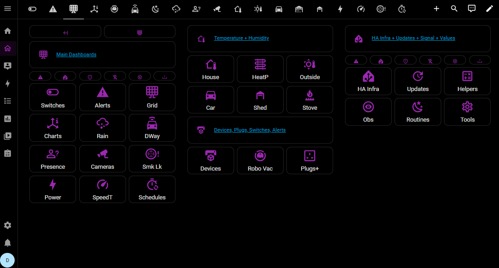
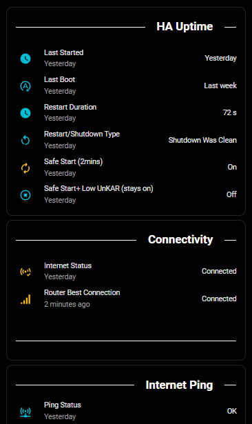
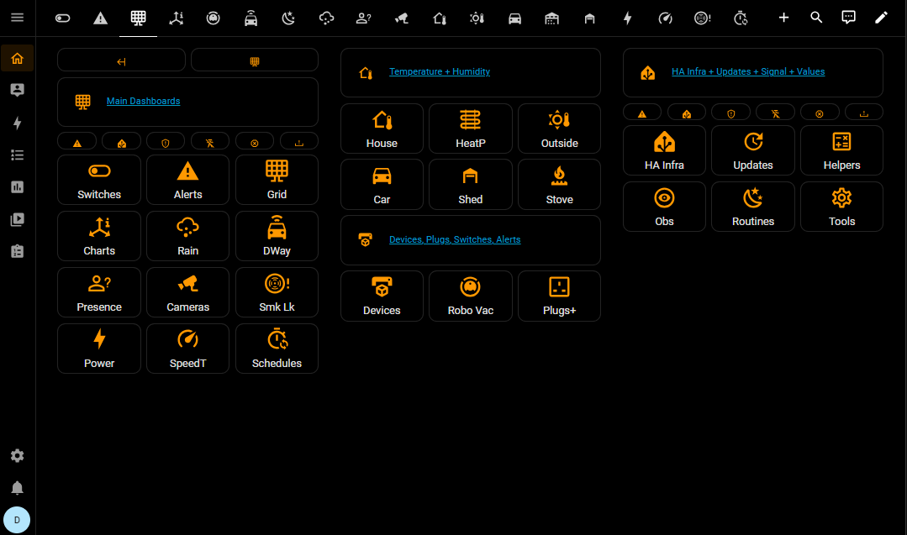

# Very Dark Black Theme for Home Assistant

   [](https://opensource.org/licenses/MIT) [](https://github.com/PlayFaster/very-dark-black-ha-theme/actions/workflows/validate.yaml) 

A Home Assistant dark mode theme that provides black or very dark backgrounds wherever possible along with a choice of primary colours.

## ✅ Features

This is a simple theme focused on providing a very dark mode look. It's designed to be clean and simple, with a choice of primary colours.

- **Black Backgrounds**: Black background applied everywhere.
- **Primary Colour Choice**: Various sub-themes with different foreground colours.
  - Cyan
  - Green
  - Red
  - Fuchsia
  - Orange
  - Purple
  - Indigo
  - Silver (Monochrome)
  - **Black Base (Shared Config)**: A utility theme used for shared logic.

## 📋 Requirements

- **[`card-mod`](https://github.com/thomasloven/lovelace-card-mod)** – Highly recommended. The theme will still work without this integration, but `card-mod` is used to polish fine UI details and ensure a consistent experience across all elements.

## 📊 Compatibility

To ensure all "Pure Black" features (like custom scrollbars and border removals) work correctly, verify you meet these minimum requirements:

| Dependency         | Minimum Version | Reason                                   |
| :----------------- | :-------------- | :--------------------------------------- |
| **Home Assistant** | `2022.11.0`     | Required for `ha-card` border variables. |
| **card-mod**       | `3.0.0`         | Required for theme-level CSS injection.  |

## 📸 Screenshots








## ✨ Installation

### Prerequisites: Enable themes and install card-mod

1. Install `card-mod` via [HACS](https://hacs.xyz/) or per the instructions on its [GitHub page](https://github.com/thomasloven/lovelace-card-mod "card-mod").

2. Add the following to your `configuration.yaml` file if not present (HA restart required):

```yaml
frontend:
  themes: !include_dir_merge_named themes
```

### Download Theme

#### HACS (Recommended)

1. Add this URL as a **Custom Repository** in HACS. `https://github.com/PlayFaster/very-dark-black-ha-theme`
   - Open HACS in Home Assistant
   - Click **Custom repositories** (⋮ menu)
   - Add repository URL and Type: `Theme`
2. Search for "Very Dark Black Theme" and click **Download**
3. Run the `frontend.reload_themes` action (Restart Home Assistant if `configuration.yaml` changes were made).

#### Manual Installation

1. Under the Home Assistant `config` folder, create a new folder named `themes`.
2. Copy the theme YAML file into it.
3. Run the `frontend.reload_themes` action (Restart Home Assistant if `configuration.yaml` changes were made).

### Apply Theme

- Go to your [Profile General](https://my.home-assistant.io/redirect/profile) tab (bottom left of screen) and change Theme under Browser Settings.

### Automate Theme Changes

You can use a Home Assistant automation to change the theme at startup, or based on any other time or condition you wish.

**Important:** In the [Profile General](https://my.home-assistant.io/redirect/profile) screen, you **must** keep **"Use default theme"** selected under the Theme settings. If you manually select a specific theme in your profile, the automation will not be able to override it.

Example automation to set the theme at startup:

```yaml
alias: Set (Default) Theme at Startup
description: >-
  This automation allows you to set or change the default theme at Home Assistant Startup, provided you keep the Default Theme selected.


triggers:
  - trigger: homeassistant
    event: start
conditions: []
actions:
  - action: frontend.set_theme
    metadata: {}
    data:
      name: Black with Orange
      name_dark: Black with Orange
mode: single
```

## 🛠️ Development

For technical details on the YAML standards, icon logic, and Shoelace tokens used in this theme, see the [Development Reference](docs/theme_dev_reference.md).

## 📝 Maintenance Status

This is a **personal project**. Support and updates are provided on a **"best-effort"** basis only. While I use this theme daily and aim to keep it functional with the latest Home Assistant releases, I cannot guarantee immediate fixes for issues or compatibility with all releases.

## 🤝 Acknowledgements & Thanks

- Inspired by the excellent [`Frosted Glass`](https://github.com/wessamlauf/homeassistant-frosted-glass-themes) themes of @wessamlauf - thank you!
- Made possible by @thomasloven and the [`card-mod`](https://github.com/thomasloven/lovelace-card-mod) contributors.
- This project was developed with the assistance of AI to ensure code quality and adherence to best practices.

## 📄 License [](https://opensource.org/licenses/MIT)

This project is licensed under the terms of the MIT License. For more details, see the [license](LICENSE) document.

---

**Questions or Issues?** Visit the [GitHub repository](https://github.com/PlayFaster/very-dark-black-ha-theme).**
