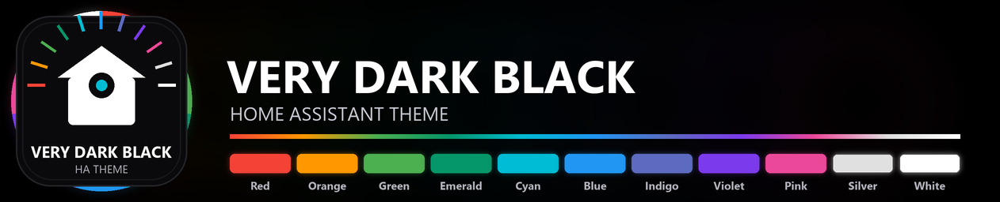
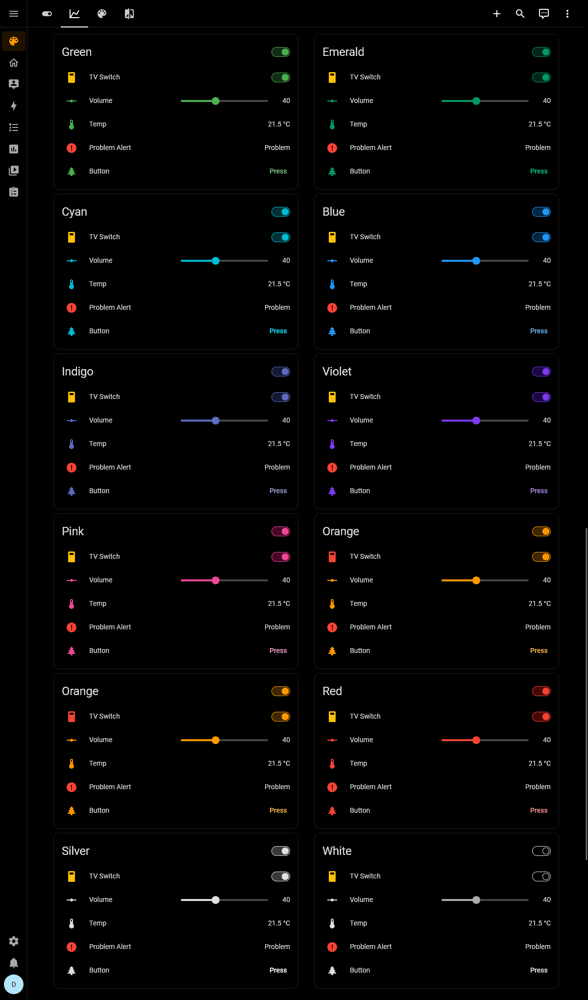
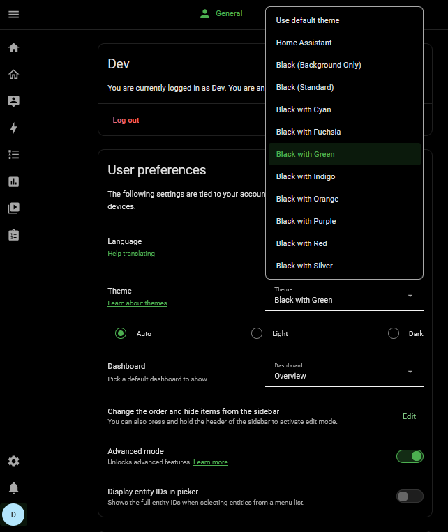
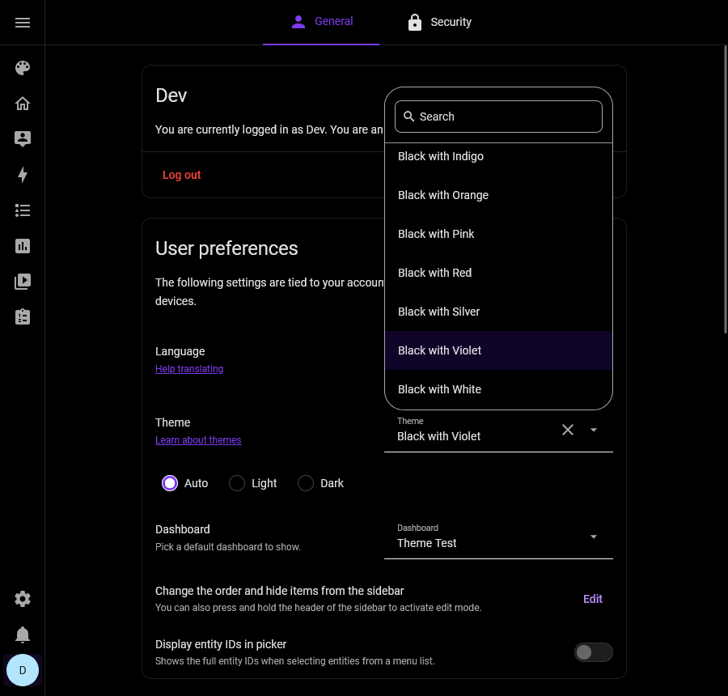

<!-- markdownlint-disable MD033 -->

# Very Dark Black Theme for Home Assistant

[](https://hacs.xyz/) [](https://my.home-assistant.io/redirect/hacs_repository/?owner=PlayFaster&repository=very-dark-black-ha-theme&category=theme) [](https://github.com/PlayFaster/very-dark-black-ha-theme/releases) [](https://opensource.org/licenses/MIT) [](https://github.com/PlayFaster/very-dark-black-ha-theme/actions/workflows/validate.yaml) [](https://github.com/PlayFaster/very-dark-black-ha-theme/commits/main)

---



---

A Home Assistant dark mode theme that provides black or very dark backgrounds wherever possible along with a choice of primary colors.

> [!NOTE]
>
> **Is this the right theme for you?**
>
> - If you want a very dark black theme, with black backgrounds everywhere and a choice of accent colors, then **yes**.
> - **This theme is for you if** you want:
>   - **Black Backgrounds Everywhere** — Pure black background applied everywhere possible.
>   - **A Clean Plain Look** — Black, white and an accent color are what you get on most views.
>   - **Accent Colors** — A choice of bold accent colors, so it's not just monochrome.

## 📋 Table of Contents

- [Very Dark Black Theme for Home Assistant](#very-dark-black-theme-for-home-assistant)
  - [📋 Table of Contents](#-table-of-contents)
  - [✅ Features](#-features)
  - [📸 Screenshots](#-screenshots)
  - [🔧 Compatibility \& Requirements](#-compatibility--requirements)
  - [🎯 Use Cases](#-use-cases)
  - [📥 Installation](#-installation)
  - [✨ Apply Theme](#-apply-theme)
  - [💡 Automations for Theme Changes](#-automations-for-theme-changes)
  - [🔩 Under the Hood - Technical Architecture](#-under-the-hood---technical-architecture)
  - [❓ FAQ \& Troubleshooting](#-faq--troubleshooting)
  - [❗ Known Limitations /❔ What's Missing?](#-known-limitations--whats-missing)
  - [❌ Removal](#-removal)
  - [📝 Maintenance Status](#-maintenance-status)
  - [🤝 Contributors \& Acknowledgements](#-contributors--acknowledgements)
  - [📄 License](#-license)

## ✅ Features

This is a simple theme focused on providing a very dark mode look. It's designed to be clean and simple, with a choice of primary colors.

- **Black Backgrounds**: Black background applied everywhere.
- **Accent Color Choice**: 11 sub-themes with different accent colors.
  - 💙 Blue
  - 🔵 Cyan
  - 💚 Emerald
  - 🟢 Green
  - 🔷 Indigo
  - 🟠 Orange
  - 🩷 Pink
  - 🔴 Red
  - 🔘 Silver (Monochrome)
  - 🟣 Violet
  - ⚪ White (Very Monochrome)

## 📸 Screenshots

### Themed Cards (all themes compared)



### Theme Selection

| Theme Select Green | Theme Select Violet |
| :-: | :-: |
|  |  |

## 🔧 Compatibility & Requirements

The minimum Home Assistant version is 2022.11.0, with `card-mod`, minimum v3.0.0, optional but recommended.

<details>

<summary>
&nbsp; &nbsp; ➕ &nbsp; &nbsp; Click to Expand for Details:
</summary><br>

- **[`card-mod`](https://github.com/thomasloven/lovelace-card-mod)** – Highly recommended. The theme will still work without this integration, but `card-mod` is used to polish fine UI details and ensure a consistent experience across all elements.

To ensure all features (like custom scrollbars and border removals) work correctly, verify you meet these minimum requirements:

| Dependency | Minimum Version | Reason |
| :-- | :-- | :-- |
| **Home Assistant** | `2022.11.0` | Required for `ha-card` border variables. |
| **card-mod** | `3.0.0` | Optional but recommended for theme-level CSS injection |

The theme is fully usable from HA 2022.11 onwards. Newer versions have additional refinements:

- **2022.11+** — Core dark backgrounds, cards, sidebar, and text
- **2025.1+** — Inputs, dialogs, and modern card layouts
- **2026.4+** — Dynamic HSL color scales
- **2026.5+** — More Web Awesome tokens for `ha-switch`, `ha-checkbox` and `ha-progress-bar`.
- **2026.6+** — Web Awesome radio button tokens for `ha-radio-group` and `ha-radio-option`.

---

</details>

<br>

## 🎯 Use Cases

**Visual Appeal** — The primary use case is that you like the appearance as your overall/main theme, but there are other ways to use it as well:

- **Color-coded views and sections** — Apply different accent colors to individual dashboard **views** (full screen) or **sections** (part of the screen) to visually separate areas of your home at a glance — for example, Cyan for climate, Orange for lighting, Red for security. See [Apply to Individual Dashboard Views or Sections](#apply-to-individual-dashboard-views-or-sections).
- **Automated theme switching** — Use the startup automation pattern in the [Automate Theme Changes](#-automations-for-theme-changes) section to switch accent colors based on time of day or presence.
- **Startup indicator** — Set **Orange** (or any accent) at boot so every glance at the dashboard confirms Home Assistant is still initializing. An automation switches back to your normal theme after two minutes once startup is complete. See [Automate Theme Changes](#-automations-for-theme-changes).
- **Visual alert highlight** — Trigger **Red** automatically when an alert condition fires (motion, smoke, door contact, etc.) so the entire UI signals the alert state at a glance. Restore your normal theme when the condition clears. See [Automate Theme Changes](#-automations-for-theme-changes).
- **Minimal monochrome setup** — Choose **Silver** or **White** for a clean, color-neutral control panel that stays out of the way. **Violet** or **Indigo** work well for a subtle accent that reads neutral rather than bold.
- **OLED and power-saving displays** — Pure black backgrounds draw no power on OLED panels, making this ideal for wall-mounted tablets or phones used as HA dashboards.
- **Pairing with popular custom cards** — The theme explicitly sets transparent backgrounds for Mushroom, Bubble, and other widely-used custom card types, giving a seamless look on black dashboards.

## 📥 Installation

### Prerequisites: Enable themes and install card-mod

1. [_Optional_ but recommended] Install `card-mod` via [HACS](https://hacs.xyz/) or per the instructions on its [GitHub page](https://github.com/thomasloven/lovelace-card-mod "card-mod").

2. [**Mandatory**] Add the following to your `configuration.yaml` file if not present (HA restart required):

```yaml
frontend:
  themes: !include_dir_merge_named themes
```

### ✨ HACS (Recommended)

[](https://my.home-assistant.io/redirect/hacs_repository/?owner=PlayFaster&repository=very-dark-black-ha-theme&category=theme)

Use the **shortcut badge** above, then click **Download** - or just …

1. Open HACS in Home Assistant and search for **Very Dark Black HA Theme**
2. Click into _Very Dark Black HA Theme_ and then Click **Download** (bottom right)
3. Run the `frontend.reload_themes` action (Restart Home Assistant if `configuration.yaml` changes were made).

### 💾 Manual Installation

1. Under the Home Assistant `config` folder, create a new folder named `themes`.
2. Copy the theme YAML file into it.
3. Run the `frontend.reload_themes` action (Restart Home Assistant if `configuration.yaml` changes were made).

### 🔄 Updating

Standard HACS Theme update behavior:

<details>

<summary>
&nbsp; &nbsp; ➕ &nbsp; &nbsp; Click to Expand for Details:
</summary><br>

- New releases show up in **HACS** as normal. Update there, then run the `frontend.reload_themes` action.
- For manual updates, follow the procedure from [Manual Installation](#-manual-installation) above, overwrite the existing theme file with the new one, then run the `frontend.reload_themes` action.

---

</details>
<br>

## ✨ Apply Theme

### Manual Control

- **Change System Theme**: Go to your [Profile General](https://my.home-assistant.io/redirect/profile) tab (bottom left of screen) and change Theme under **_User preferences_**.

### Via Automation

- **Automated Changes**: Using the `frontend.set_theme` action and automations or scripts, you can change themes based on triggers and conditions. See the [Automations for Theme Changes](#-automations-for-theme-changes) section, and note the requirement that you keep **"Use default theme"** selected in the UI. This means that Manual and Automation control are mutually exclusive.

### Apply to Individual Dashboard Views or Sections

Themes can be applied at three levels of scope, making it easy to mix accent colors for visual differentiation and highlighting across your dashboard — for example, Red for a security view, Orange for a lighting panel, or Cyan for climate controls:

- **System** — Applies to the entire UI (set via your profile, as [above](#-apply-theme), or via [automation](#-automations-for-theme-changes), as below).
- **View** — Applies to one entire dashboard view (full screen). The main way to give different rooms or functional areas their own accent color.
- **Section** — Applies to one section within a view (partial screen). Use this to highlight a specific area or card group without changing the whole view.

To apply a theme to a view or section, from any custom dashboard view click the pencil icon (top right) _then_:

- **View**: Use the pencil icon for the specific view (**_second_** row) and you will find a Theme selector in the options.
- **Section**: Use the **three dots** (⋮) at the top right of the specific Section, then **_Edit_** and you will find a Theme selector at the end of the options.

## 💡 Automations for Theme Changes

You can use a Home Assistant automation to change the system theme at startup, or based on any other time or condition you wish.

| Scenario | Trigger | Jump to |
| :-- | :-- | :-- |
| Set a theme every time HA starts | HA startup | [Set Theme at Startup](#-set-theme-at-startup) |
| Signal initializing, then restore your normal theme | HA startup + 2 min delay | [Startup Indicator](#-startup-indicator-with-delayed-restore) |
| Switch to Red on an alert, restore when it clears | Entity state on / off | [Visual Alert](#-visual-alert-theme) |

### 🔧 Setup Requirements

> [!IMPORTANT]
>
> In the [Profile General](https://my.home-assistant.io/redirect/profile) screen, you **must** keep **"Use default theme"** selected under _User preferences_ > _Theme settings_.
>
> - Theme automating works by having the System Theme set to **"Use default theme"** and then using an Automation `action:` to _change_ the default theme.
> - If you manually select a specific theme in your profile, the automation will not be able to override it.

### 🟠 Set Theme at Startup

<details>

<summary> &nbsp; &nbsp; Example automation to set the theme at startup:<br>
&nbsp; &nbsp; &nbsp; &nbsp; ➕ &nbsp; Click to Expand for Automation Detail:
</summary><br>

```yaml
alias: Set (Default) Theme at Startup
description: |-
  This automation allows you to set or change the default theme at Home Assistant Startup, provided you keep the Default Theme selected.
triggers:
  - trigger: homeassistant
    event: start
conditions: []
actions:
  - action: frontend.set_theme
    data:
      name: Black with Orange
      name_dark: Black with Orange
mode: single
```

---

</details>

### ⏳ Startup Indicator with Delayed Restore

<details>

<summary> &nbsp; &nbsp; Example automation for a **startup indicator** that signals Home Assistant is initializing, then switches back to your normal theme after 2 minutes:<br>
&nbsp; &nbsp; &nbsp; &nbsp; ➕ &nbsp; Click to Expand for Automation Detail:
</summary><br>

```yaml
alias: Startup Indicator - Theme
description: |-
  Sets Orange at startup to signal Home Assistant is initialising.
  Switches back to your preferred theme after 2 minutes.
triggers:
  - trigger: homeassistant
    event: start
conditions: []
actions:
  - action: frontend.set_theme
    data:
      name: Black with Orange
      name_dark: Black with Orange
  - delay: "00:02:00"
  - action: frontend.set_theme
    data:
      name: Black with Cyan
      name_dark: Black with Cyan
mode: single
```

---

</details>

### 🚨 Visual Alert Theme

<details>

<summary> &nbsp; &nbsp; Example automation for a **visual alert** that switches to Red when a condition fires and restores your normal theme when it clears:<br>
&nbsp; &nbsp; &nbsp; &nbsp; ➕ &nbsp; Click to Expand for Automation Detail:
</summary><br>

```yaml
alias: Visual Alert - Theme
description: |-
  Switches to Red when an alert condition fires.
  Restores your normal theme when the condition clears.
triggers:
  - trigger: state
    entity_id: binary_sensor.your_alert_sensor
    to: "on"
    id: alert_on
  - trigger: state
    entity_id: binary_sensor.your_alert_sensor
    to: "off"
    id: alert_off
conditions: []
actions:
  - choose:
      - conditions:
          - condition: trigger
            id: alert_on
        sequence:
          - action: frontend.set_theme
            data:
              name: Black with Red
              name_dark: Black with Red
      - conditions:
          - condition: trigger
            id: alert_off
        sequence:
          - action: frontend.set_theme
            data:
              name: Black with Cyan
              name_dark: Black with Cyan
mode: single
```

Replace `binary_sensor.your_alert_sensor` with any entity that signals your alert condition (motion sensor, smoke detector, door contact, etc.) and replace `Black with Cyan` in both automations with your preferred default theme.

---

</details>

## 🔩 Under the Hood - Technical Architecture

For technical details on the YAML standards, logic, and various display element tokens used in this theme, see the [Development Reference](docs/DEVELOPMENT.md). It covers the 3-section YAML anchor structure used to share tokens across accent variants without duplication, the full list of HA display element tokens targeted, card-mod CSS injection details, and guidance for adding new accent color variants.

## ❓ FAQ & Troubleshooting

### 🔧 Installation & Setup

#### **Theme fails to apply**

<details>

<summary>
&nbsp; &nbsp; ➕ &nbsp; &nbsp; Click to Expand for Details:
</summary><br>

- Ensure that you have followed the [Installation](#-installation) instructions above.
- If you had to add the `themes:` block to `configuration.yaml`, a full Home Assistant restart is required; `frontend.reload_themes` alone is not enough in that case.

---

</details>

<br>

#### **Theme fails to apply in specific view or cards**

<details>

<summary>
&nbsp; &nbsp; ➕ &nbsp; &nbsp; Click to Expand for Details:
</summary><br>

- Items like custom dashboards (dashboard views), cards and card elements can have specific themes applied, separate to the system theme.
- To check or modify this for views or sections, see [Apply Theme](#apply-theme) above.
- If one element has a different (unexpected) theme, it may be a theme or color setting inside the individual card:
  - To check use the pencil icon (top right), then click into the specific card and look for theme and/or color options in the settings.

---

</details>

<br>

#### **Theme does not appear in the picker after installation**

<details>

<summary>
&nbsp; &nbsp; ➕ &nbsp; &nbsp; Click to Expand for Details:
</summary><br>

- Confirm that the `frontend.reload_themes` action has been run (or Home Assistant restarted) after installation.
- If using manual installation, check that the YAML file is directly inside the `config/themes/` folder — not in a sub-folder.
- If you had to add the `themes:` block to `configuration.yaml`, a full Home Assistant restart is required; `frontend.reload_themes` alone is not enough in that case.

---

</details>

<br>

#### **card-mod CSS features are not working**

<details>

<summary>
&nbsp; &nbsp; ➕ &nbsp; &nbsp; Click to Expand for Details:
</summary><br>

- Confirm that `card-mod` is installed and at least version 3.0.0. Without it, the theme still applies but custom scrollbars, transparent card overrides, and some border details will not be active.
- After installing or updating `card-mod`, clear your browser cache and reload the page.

---

</details>

<br>

### 🎨 Display & Styling

#### **Specific elements look un-styled after a Home Assistant update**

<details>

<summary>
&nbsp; &nbsp; ➕ &nbsp; &nbsp; Click to Expand for Details:
</summary><br>

- Home Assistant occasionally renames or adds CSS tokens when it updates its frontend components. If a UI element loses its styling after an HA update, it is likely a new or renamed token that the theme has not yet been updated to cover.
- Check the [GitHub repository](https://github.com/PlayFaster/very-dark-black-ha-theme) for a recent release addressing the update, or open an issue there.

---

</details>

<br>

## ❗ Known Limitations /❔ What's Missing?

<details>

<summary>
&nbsp; &nbsp; ➕ &nbsp; &nbsp; Click to Expand for Details:
</summary><br>

- **Color Picker**: The theme has eleven pre-defined accent colors available, but there is no option to select your own accent color to work with the theme. To my knowledge, this functionality is not available within the Home Assistant basic theme file, it would require an additional script or custom component, so it is not in scope for this project.
- **Light Theme**: The theme works in "Light" mode, but still applies the Very Dark Black theme, a dark mode theme. This is deliberate, this is not a light mode theme.
- **Base Themes in Picker**: The base (anchor) theme `Black with White` appears in the picker alongside the accent variants. This is a known limitation of the Home Assistant theme file structure: building accent variants from a shared base requires that base to be a named theme entry, which makes it selectable. There are no plans to change this behavior — "Fixing" this either results in log warnings/errors or a huge theme file that becomes difficult to maintain. `Black with White` is a fully functional minimalist dark theme and intentionally treated as a variant in its own right.

---

</details>

<br>

## ❌ Removal

To remove the integration from Home Assistant:

<details>

<summary>
&nbsp; &nbsp; ➕ &nbsp; &nbsp; Click to Expand for Details:
</summary><br>

First, set a different theme:

- Go to your [Profile General](https://my.home-assistant.io/redirect/profile) tab (bottom left of screen) and change Theme under User preferences.

If you installed manually:

- Under the Home Assistant `config/themes` folder, delete the `very_dark_black_ha_theme.yaml` file.
- Run the `frontend.reload_themes` action (or restart Home Assistant) to clear the theme from the picker

If you installed via HACS:

1. Go to **HACS**.
2. Find **Very Dark Black HA Theme** and click into it.
3. Click the **three dots** (⋮) at the top right and select **Remove**.
4. Restart Home Assistant.

---

</details>

<br>

## 📝 Maintenance Status

This is a **personal project**. Support and updates are provided on a **"best-effort"** basis only. While I use this theme daily and aim to keep it functional with the latest Home Assistant releases, I cannot guarantee immediate fixes for issues or compatibility with all releases.

## 🤝 Contributors & Acknowledgements

- 🙏 Inspired by these excellent themes - thank you!
  - [`Frosted Glass`](https://github.com/wessamlauf/homeassistant-frosted-glass-themes) themes of @wessamlauf
  - [`Graphite`](https://github.com/TilmanGriesel/graphite) themes of @TilmanGriesel
- 🙏 Made possible by @thomasloven and the [`card-mod`](https://github.com/thomasloven/lovelace-card-mod) contributors.
- This project was developed with the assistance of AI to ensure code quality and adherence to best practices.

## 📄 License

[](https://opensource.org/licenses/MIT)

This project is licensed under the terms of the MIT License. For more details, see the [license](LICENSE) document.

---

💬 **Questions or Issues?** Visit the [GitHub repository](https://github.com/PlayFaster/very-dark-black-ha-theme).
