# Card-Mod Dependency Analysis

Theme file analysis to assess the card-mod dependency and identify what could now be handled natively.



## Detailed breakdown

**How much card-mod does this theme depend on: ~40–50% of the file, but only 20% is actually _critical_.**

### The three layers of card-mod usage

**1. Critical (scrollbar styling)** — `card-mod-card` block Scrollbar styling (`*::-webkit-scrollbar` CSS) has _no native Home Assistant equivalent_. This is genuinely card-mod-only:

- Scrollbar width, color, border-radius
- Applies to card scrolls, select dropdowns, any scrollable region

Without this, scrollbars fall back to system defaults (usually light gray on dark, which breaks your black theme).

**2. Nice-to-have (dialog & more-info polish)** — `card-mod-more-info` block This targets the more-info dialog's internal structure. Home Assistant has added many native variables for dialogs (`mdc-dialog-*`, `ha-dialog-*`), but card-mod gives you _surgical_ control:

- Headings inside the more-info panel
- Dialog background and overlay color

The theme _could_ live without this — the native variables will handle 80% of it — but it's the 20% that makes it feel truly integrated.

**3. Optional (theme declaration)** — `card-mod-theme: "Black with Cyan"` etc. This tells card-mod which theme to apply in YAML-based cards. If you're not using YAML-based lovelace cards, this does nothing. Even with YAML cards, it's mostly cosmetic—native variables handle the heavy lifting already.

---

### What you can delete right now

It is possible to delete these entire blocks from your YAML:

```yaml
# SAFE TO DELETE (HA handles all of this now):
- mdc-text-field-* (all of them)
- mdc-select-* (all of them)
- md-sys-color-surface-container* (all of them)
- ha-filled-text-field-fill-color
- ha-filled-select-fill-color
- ha-color-form-background* (all variants)
- input-dropdown-icon-color
- input-label-ink-color
- input-idle-line-color
- mdc-select-idle-line-color
- mdc-text-field-idle-line-color
- input-fill-color
- sl-input-* (all of them)
- paper-listbox-*
- mdc-snackbar-* (HA now handles this natively)
- mdc-theme-surface, mdc-theme-on-surface, mdc-theme-background
- ha-dialog-surface-background, paper-dialog-background-color
```

That's roughly **50 variables** that could be confidently deleted. They're now either:

- Handled by Home Assistant's native MDC/Material Design token system, or
- Not needed anymore because HA updated the underlying components

> [!IMPORTANT]
>
> Deleting these will reduce compatibility with older HA installs.

**Keep only these sections** for card-mod:

1. **`card-mod-card`** — for scrollbar styling
2. **`card-mod-more-info`** — for dialog polish (optional, but nice)
3. **Remove or comment out `card-mod-theme`** declarations — they're not needed when native variables do the work

---

### The modernization checklist

- [x] Base color/background/text variables are all native now
- [x] Control states (switch, radio, checkbox) are native
- [x] Inputs and dropdowns: ~90% native, only edge cases need card-mod
- [ ] Scrollbars: card-mod only—no native replacement yet
- [ ] Dialog styling: hybrid—native handles 80%, card-mod adds polish

**Bottom line**: The theme was built when Home Assistant's theming system was limited. It's now much richer. It is carrying ~100 lines of obsolete variables that do nothing. Keep the scrollbar CSS and the dialog tweaks (true card-mod work), delete the rest.
